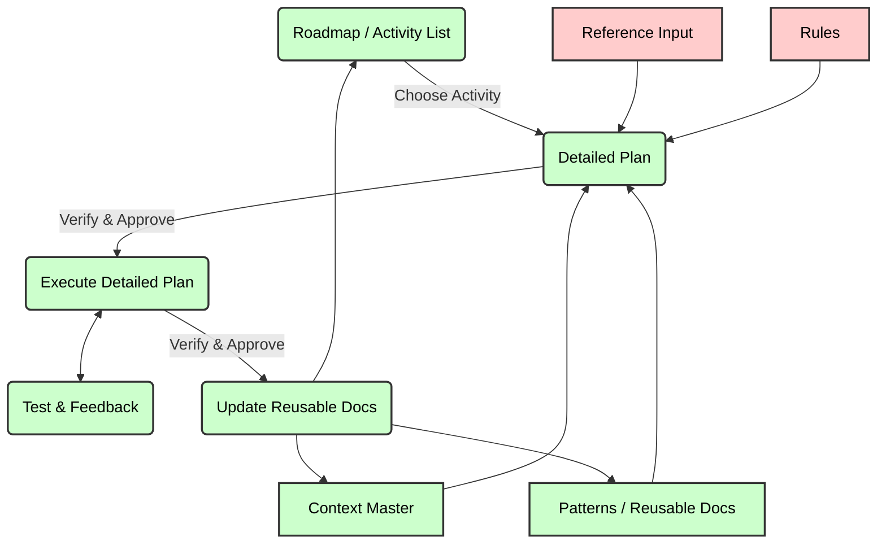
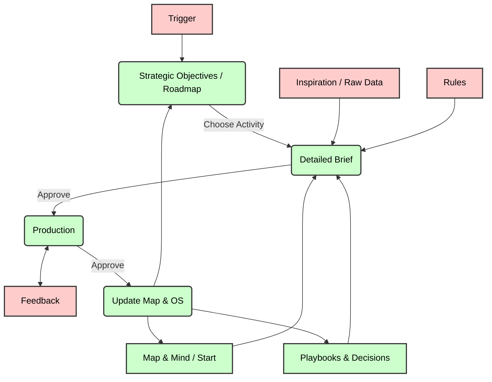

# FluxFrame

**The context-first framework for AI-assisted development.**

**Build better software faster with AI assistance that scales intelligence, not just productivity.**

[]()
[]()
[]()

---

## What is This?

A **self-bootstrapping framework** for AI-assisted software development that transforms how you build software with multiple AI coding agents.

**Key Innovation:** Point your AI assistant at this framework, provide a project description, and it will automatically generate a complete, production-ready development environment with documentation, patterns, workflows, and configuration—no manual template copying required.

---

## Why This Exists

### The Problem

AI coding assistants are powerful, but without structure:
- ❌ They forget context between sessions
- ❌ They create inconsistent code
- ❌ They skip documentation
- ❌ They don't learn from past mistakes
- ❌ Quality degrades as projects grow

### The Solution

This framework provides:
- ✅ **Persistent Context** - MCP integration gives AI the same context as your team
- ✅ **Pattern Libraries** - Capture and scale team intelligence
- ✅ **Development Workflows** - Systematic approach to iterations and changes
- ✅ **Documentation First** - Documents as product, not afterthought
- ✅ **Quality Enforcement** - API contracts, testing alignment, rule consistency
- ✅ **Self-Bootstrapping** - AI generates everything from simple project description

**Result:** Compound effect of discipline, scaled through AI assistance.


---

## Abstraction of Concepts

FluxFrame isn't just a set of files; it's a philosophy of work. To understand why it's structured this way, we can look at it through two lenses: the technical reality of AI LLMs, and the business reality of management.

### 1. Technical Reality (The "Why")

Why do we need such a strict structure? Because LLMs have inherent limitations that "chatting" doesn't solve.



FluxFrame addresses four fundamental problems in AI-assisted coding:

1.  **Limited Context Window (Amnesia):** An AI can't hold your entire codebase and history in its head. FluxFrame solves this with **Context Distillation** (`AGENTS.md` as the always-loaded vehicle, with on-demand reference files), creating a high-density map of your project that fits in context.
2.  **Hallucinations:** Without grounding, AI guesses. FluxFrame forces **Grounding** by examining `technical_status.md` (Current Reality) and `patterns/` (Historical Truth) before every task.
3.  **Randomness / Creativity:** In code, creativity is often a bug. FluxFrame enforces **Pattern Compliance**, turning "creative writing" into reliably following your team's established best practices.
4.  **The "Weight of Words":** In a chat, a random idea has the same weight as a security protocol. FluxFrame solves this with **Binding Levels**:
    *   **Level 1 (Law):** Rules & Patterns (Must follow)
    *   **Level 2 (Reality):** Technical Status (Must accept)
    *   **Level 3 (Intent):** The Plan (Must execute)
    *   **Level 4 (Noise):** Reference Material (May inspire)

---

### 2. The Universal Workflow (The "Project OS")

If we zoom out, FluxFrame is not just for code. It helps you move from being an **Operator** (doing the work) to an **Architect** (managing the system).

Think of your AI not as a tool, but as a workforce of **brilliant but amnesic interns**. They need a manager.



In this universal view:

*   **Strategic Objectives:** Your quarterly goals or "Must-Do" list.
*   **The Brief:** Defined success criteria. The AI drafts it, you approve it.
*   **The Project OS:** Instead of a "Company Brain," think of this as your **Operating System**. It is the master map of **WHERE** things are stored and **HOW** processes must run.
*   **Playbooks:** "The Way We Do Things Here."
*   **Production:** The AI executes—writing code, drafting contracts, or creating campaigns.

**The Loop:** The most critical part is the arrow pointing back. When you finish a task, you don't just ship the result. You **update the OS**. This means your "company" gets smarter with every single task, building a compounding asset of intelligence.

---

## Getting Started: MCP-Powered Bootstrap

**FluxFrame uses an MCP (Model Context Protocol) server that ensures reliable, step-by-step bootstrap with automatic progress tracking.**

### Why MCP Is Required

MCP ensures the bootstrap process is followed correctly:
- ✅ Every step tracked and validated
- ✅ Progress persists across sessions
- ✅ Resume anytime from where you left off
- ✅ AI knows exactly what to do next
- ✅ Required questions cannot be skipped

### Quick Start

Choose your scenario:

#### A) Existing Project

**Step 1:** Ensure your project is under version control:
```bash
cd your-project
git init  # if not already a git repo
git add -A && git commit -m "Snapshot before FluxFrame"
```

**Step 2:** Add FluxFrame to your project root:
```bash
git clone https://github.com/trylof/fluxframe.git
```

**Step 3:** Tell your AI assistant:
```
Read fluxframe/BOOTSTRAP_INSTRUCTIONS.md and bootstrap FluxFrame for this project.
```

#### B) Starting Fresh

**Step 1:** Create a new project directory with a project brief:
```bash
mkdir my-new-project && cd my-new-project
git init
# Create a file describing your project (e.g., project_brief.md)
```

**Step 2:** Add FluxFrame:
```bash
git clone https://github.com/trylof/fluxframe.git
```

**Step 3:** Tell your AI assistant:
```
Read fluxframe/BOOTSTRAP_INSTRUCTIONS.md and bootstrap FluxFrame for this project.
```

---

**From there, the AI handles everything:**
1. Run `npm install` if dependencies are missing
2. Check if MCP is configured
3. If not, **guide you through MCP setup step-by-step** (no prior knowledge needed)
4. After you restart with MCP configured, detect your project
5. Ask required questions (cannot skip)
6. Generate configuration
7. Present everything for your approval

### What If MCP Isn't Set Up Yet?

**You don't need to know how to configure MCP.** When you ask the AI to bootstrap:

- If MCP is already configured → bootstrap proceeds automatically
- If MCP is not configured → **the AI guides you through setup interactively**
  - Asks which AI tool you're using
  - Shows you exactly where to add configuration
  - Helps you figure out the right paths
  - Walks you through restart and verification

**See:** [`bootstrap/MCP_SETUP_GUIDE.md`](bootstrap/MCP_SETUP_GUIDE.md) for reference (the AI will guide you through this).

### Works for ANY Project State

FluxFrame's **detection-first** bootstrap works whether you have:
- 🆕 **New project** - No existing workflow or docs
- 🔄 **Existing AI workflow** - Already using Cline, Claude Code, etc.
- 📚 **Existing documentation** - ADRs, wikis, bug fix history, etc.

| Your Project Has | Bootstrap Does |
|------------------|---------------|
| Nothing (new project) | Full setup from scratch |
| Existing `.clinerules` or similar | Diff, ask about differences, upgrade |
| Existing `docs/` with ADRs, wikis | Ask copy/migrate/reference for each |
| Mix of above | Handles all intelligently |

---

## What Gets Generated

### Complete Documentation

```
your-project/
├── project_docs/
│   ├── document_catalog.md          # Detailed document descriptions (on-demand)
│   ├── completion_protocol.md       # Validation & completion checklists (on-demand)
│   ├── technical_status.md          # Real-time project state
│   ├── ROADMAP.md                   # Roadmap & cycles
│   ├── api_contract_standards.md    # API enforcement rules
│   ├── templates/                   # Boilerplate templates
│   │   └── change_request.md
│   └── patterns/                    # Pattern library
│       └── README.md
```

### AI Configuration

```
├── .clinerules (or .roorules)       # AI assistant rules
└── mcp-server.js                    # Context provider
```

### All Filled with Your Project Details

No `{{PLACEHOLDERS}}` to find/replace. No manual editing. Just review and start coding.

---

## Core Concepts

### 1. Universal AI Baseline (AGENTS.md)

**Philosophy:** One source of truth for all tools.

Every FluxFrame project starts with `AGENTS.md`, an open-standard configuration that works across **Claude Code, Roo Code, Cline, Cursor, Antigravity**, and others.

- Consistent instructions across every tool your team uses.
- Layered architecture: Basic compatibility (symlinks) or Full tool integration.

### 2. Pattern-Driven Development

**Workflow:** Check patterns → Follow or create → Document

Before implementing anything:
```
MCP Tool: check_pattern_exists(feature_description)
→ Pattern exists: Follow it exactly
→ No pattern: Implement, then document for next time
```

**Benefits:**
- Consistent code across team
- Faster development (reuse proven solutions)
- Knowledge scales automatically
- New team members get up to speed quickly

### 3. Development Cycles (Not "Features")

**Systematic approach to iterations:**

**BEFORE cycle:**
- Gather context via MCP
- Check existing patterns
- Read current status
- Plan approach

**DURING cycle:**
- Real components only (no stubs)
- Visible results
- Aligned tests
- Follow patterns

**AFTER cycle:**
- Update ALL affected docs
- Validate completeness
- Get user confirmation
- Document patterns

**Why "Cycles" not "Features":** Emphasizes iterative, complete work units.

### 4. API Contract Enforcement

**Contract-first development from Day 1:**

Choose your approach during bootstrap:
- **OpenAPI** + Pydantic + Auto-generated TypeScript (recommended)
- **GraphQL** with typed schema
- **JSON Schema** + manual types
- **Custom** (documented) approach

Then enforced via:
- `.clinerules` (or `.roorules`) validates every endpoint
- MCP tool `validate_api_contracts()` checks compliance
- Breaking changes caught at compile time

**Why:** Integration failures prevented, not debugged.

### 5. Test-Implementation Alignment

**Critical Rule:** Tests validate what you ACTUALLY built, not what you PLANNED.

- Tests written after implementation
- Tests match real behavior
- No stubs in production tests
- Real analysis always

**Why:** Tests as executable specifications, drift detection.

### 6. Change Request Protocol

**Systematic bug fixes and refinements:**

1. **Initialize** - `start_change_request()` tracks the issue
2. **Analyze** - Understand root cause (no code changes yet)
3. **Iterate** - Fix, test, refine
4. **Confirm** - User validates it works
5. **Document** - Update ALL affected docs

**Key:** Never document during iteration. Only after user confirms success.

**Why:** Documentation reflects reality, not hopes.

### 7. MCP Integration

**Model Context Protocol** gives AI same context as humans:

Built-in MCP tools:
- `get_context_for_task()` - Context for current work
- `check_pattern_exists()` - Search pattern library
- `get_current_implementation_status()` - Read current state
- `validate_api_contracts()` - Check endpoint compliance
- `start_change_request()` - Track bug fixes
- `validate_cycle_completion()` - Ensure work complete

**Why:** AI has persistent memory across sessions.

**Tool Override Rules:** Some AI assistants (notably Claude Code) have built-in planning and task tools that overlap with FluxFrame's MCP workflow. FluxFrame's tool-specific templates include explicit override rules that map these built-ins to their MCP equivalents, preventing the assistant from silently bypassing gates, cycle tracking, and documentation workflows.

---

## Framework Structure

```
fluxframe/
├── README.md                          # You are here
├── PHILOSOPHY.md                      # Why this works
├── BOOTSTRAP_INSTRUCTIONS.md          # AI's unified entry point
│
├── bootstrap/                         # Self-bootstrapping system
│   ├── MCP_SETUP_GUIDE.md             # MCP configuration reference
│   ├── api_contract_questionnaire.md  # API contract questions
│   ├── detection_guide.md             # How to analyze existing projects
│   ├── greenfield_workflow.md         # New project setup
│   ├── migration_workflow.md          # Adapt existing documentation
│   ├── project_questionnaire.md       # Question reference by scenario
│   ├── similar_workflow.md            # Upgrade existing AI workflow
│   └── validation_checklist.md        # Final validation
├── doc-templates/                     # Project documentation templates
│   ├── document_catalog.template.md
│   ├── completion_protocol.template.md
│   ├── change_request_template.template.md
│   ├── technical_status.template.md
│   ├── roadmap.template.md
│   ├── cycle_implementation_plan.template.md
│   ├── bugs.template.md
│   ├── bug_fix_plan.template.md
│   └── api_contract_standards.template.md
│
├── ai-rules/                          # AI assistant configuration
│   ├── README.md                      # AI rules overview
│   ├── FEATURE_MATRIX.md              # Tool comparison
│   ├── CUSTOMIZATION_GUIDE.md         # How to customize rules
│   ├── RULE_ENFORCEMENT.md            # Enforcement patterns
│   ├── core/                          # Universal AGENTS.md template
│   ├── claude-code/                   # Claude Code templates
│   ├── roo-code/                      # Roo Code templates
│   ├── cline/                         # Cline templates
│   ├── antigravity/                   # Antigravity templates
│   └── compatibility/                 # Symlink guides
│
├── mcp-server/                        # Context provider
│   └── template-mcp-server.js
│
├── pattern-library-system/            # How to create patterns
│   ├── README.md
│   └── meta-patterns/
│       ├── how_to_document_patterns.md
│       └── pattern_template.md
│
├── development-cycles/                # Iteration methodology
│   └── completion_checklist.md
│   (Workflows generated from doc-templates/workflows/)
│
├── testing-framework/                 # Testing philosophy
│   ├── README.md
│   └── test_data_alignment.md
│
└── examples/                          # Complete example
    └── taskflow-pro/                 # Fictitious SaaS project
        ├── README.md
        ├── project_brief.md
        ├── bootstrap_decisions.md    # Gate 1.5 content mapping
        ├── AGENTS.md                 # Universal AI baseline
        ├── CLAUDE.md                 # Claude Code extension
        └── project_docs/
            ├── document_catalog.md
            ├── completion_protocol.md
            ├── technical_status.md
            ├── ROADMAP.md
            ├── api_contract_standards.md
            ├── templates/            # Boilerplate templates
            ├── patterns/             # Prescriptive patterns
            ├── reference_library/    # Descriptive context
            ├── workflows/
            └── tech-status/          # Archived cycles
```

---

## Who Should Use This

### ✅ Perfect For

- **Individual developers** building side projects
- **Small teams** (2-5 people) wanting consistency
- **AI-first development** teams
- **Projects with AI coding assistants** (Cline/Roo)

---

## Benefits

### For Individual Developers

- 🧠 **External Memory** - AI remembers patterns between sessions
- 📚 **Knowledge Base** - Build reusable pattern library
- 🎯 **Focus** - Clear workflows eliminate decision fatigue
- 📈 **Growth** - Document learnings as you go

### For Small Teams

- 🤝 **Consistency** - Everyone follows same patterns
- 🚀 **Onboarding** - New members read patterns and start contributing
- 🔄 **Knowledge Transfer** - Patterns capture team intelligence
- 🛡️ **Quality** - Enforced standards prevent drift

### For Projects

- ✅ **Type Safety** - API contracts enforced
- 🔍 **Visibility** - Always know current state
- 📝 **Documentation** - Maintained automatically as you build
- 🐛 **Debugging** - Systematic change protocol catches issues
- 🔬 **Testing** - Tests match implementation

---

## Example: TaskFlow Pro

See complete working example in [`examples/taskflow-pro/`](examples/taskflow-pro/)

**Demonstrates FluxFrame 0.5.0 features:**
- Two-Tier Planning System (Agent Protocol with plan/review/build phases)
- Reference Library (prescriptive vs. descriptive documentation)
- Archive strategy (completed cycles move to `tech-status/`)
- Gate 1.5 content source mapping (`bootstrap_decisions.md`)
- Comprehensive MCP tool references
- API patterns (FastAPI + Pydantic)
- UI patterns (React + TypeScript)
- Data patterns (React Query)
- Full AGENTS.md configuration

**Use it to:**
- Learn what good patterns look like
- See filled templates matching current framework
- Understand bootstrap output structure
- Validate your own setup

---

## Philosophy

### Documentation-First Development

> "If it's not in the docs, it doesn't exist."

Documentation is the product, code is the implementation. This inverts traditional approaches where docs are an afterthought.

**Benefits:**
- Context stays synchronized
- AI has same knowledge as humans
- New team members productive immediately
- Technical debt visible and manageable

### Pattern Libraries Scale Intelligence

Patterns capture solutions to recurring problems. Once documented, patterns scale across:
- Team members (everyone uses best approach)
- Time (solutions don't get lost)
- AI assistants (patterns guide code generation)

**Why it works:** Each pattern documented multiplies its value.

### Systematic Beats Ad-Hoc

Workflows like development cycles and change request protocol provide structure that prevents common mistakes:
- Forgetting to document
- Skipping tests
- Breaking API contracts
- Incomplete implementations

**Discipline applied consistently compounds over time.**

---

## Advanced Usage

### Customizing for Your Stack

Framework supports any tech stack:
1. During bootstrap, specify your technologies
2. AI fills templates with your stack details
3. Create patterns specific to your architecture
4. Customize MCP tools if needed

### Adding Custom MCP Tools

The framework MCP server is extensible:
```javascript
// Add project-specific tools
addTool('validate_my_custom_requirement', {
  description: 'Check custom project constraint',
  // ... implementation
});
```

### Evolving Your Patterns

Patterns have lifecycle:
1. 🔵 **Experimental** - New pattern, being validated
2. 🟡 **Established** - Proven, preferred approach
3. 🟢 **Canonical** - Must follow exactly
4. 🟣 **Mandatory** - Required by architecture

Promote patterns as confidence grows.

### Harmonizing Existing Code

For existing projects:
1. Bootstrap framework in separate directory
2. Document current patterns
3. Identify inconsistencies
4. Create harmonization backlog
5. Gradually align code to patterns

---

## Compatibility

### AI Assistants

- ✅ **Claude Code** - Full support with `CLAUDE.md` + `.claude/rules/` (includes tool override rules to prevent built-in tools from bypassing MCP workflow)
- ✅ **Roo Code** - Full support with `.roomodes` + `.roo/rules/`
- ✅ **Cline** - Full support with `.clinerules/`
- ✅ **Cursor** - Support via `AGENTS.md`
- ✅ **Antigravity** - Full support with `GEMINI.md`
- ✅ **Codex** - Support via `AGENTS.md`

### Tech Stacks

- ✅ **Any backend** - Python, Node.js, Go, Java, etc.
- ✅ **Any frontend** - React, Vue, Angular, Svelte, etc.
- ✅ **Any database** - PostgreSQL, MongoDB, MySQL, etc.
- ✅ **Any architecture** - Monolith, microservices, serverless, etc.

### API Approaches

- ✅ **OpenAPI** (recommended for REST)
- ✅ **GraphQL** (recommended for graph APIs)
- ✅ **JSON Schema** (lightweight option)
- ✅ **Custom** (with documentation requirement)

---

## Contributing

### Improving the Framework

Found a better pattern? Discovered a workflow improvement? Share it!

1. Create issue describing improvement
2. Show before/after if applicable
3. Explain benefits
4. Propose changes to templates/docs

### Sharing Your Patterns

Created patterns for your domain? Help others!

1. Genericize domain-specific details
2. Document use case clearly
3. Include implementation and pitfalls
4. Submit as example pattern

---

## FAQ

**Q: Do I need to use ALL the framework features?**  
A: No. Take what's useful. Minimum viable: AGENTS.md + patterns + tool-specific rules

**Q: Is MCP setup required?**
A: Yes, for bootstrap. The MCP server ensures reliable step-by-step setup. After bootstrap completes, you'll use your project's own MCP server for ongoing development.

**Q: How much overhead is this?**  
A: Bootstrap: 10 minutes. Ongoing: 5-10 minutes per iteration to update docs. Net time savings: massive.

**Q: What if my project is already started?**  
A: Bootstrap in parallel, document current patterns, harmonize gradually. No need to rewrite.

**Q: Does this work for non-web projects?**  
A: Yes. Framework is universal. Mobile, desktop, CLI, embedded—all work.

**Q: Can I modify the templates?**  
A: Absolutely. Templates are starting points. Adapt to your needs.

**Q: What about private/proprietary code?**  
A: Framework is generic. Your patterns and docs stay private. No CultureFit or real project references.

**Q: How do I share this with my team?**  
A: Point them at this README. Bootstrap creates team-sharable structure.

---

## Resources

### Documentation

- [Philosophy](PHILOSOPHY.md) - Why this works
- [Bootstrap Instructions](BOOTSTRAP_INSTRUCTIONS.md) - AI's setup guide
- [Example Project](examples/taskflow-pro/) - Complete reference

### Components

- [Document Templates](doc-templates/) - Project documentation
- [AI Rules](ai-rules/) - Assistant configuration  
- [Pattern System](pattern-library-system/) - Pattern library methodology
- [Development Cycles](development-cycles/) - Iteration workflows
- [Testing Framework](testing-framework/) - Testing philosophy

---

## License

This framework is provided as-is for use in any project. 

Recommended: Keep framework directory separate from your project code. Bootstrap generates your project-specific files.

---

## Next Steps

1. **Read the philosophy**: [PHILOSOPHY.md](PHILOSOPHY.md)
2. **Try bootstrapping**: Create a project_brief.md and follow Quick Start
3. **Study the example**: [examples/taskflow-pro/](examples/taskflow-pro/)
4. **Start your first iteration**: Let AI guide you through the workflow

---

**Build better software faster. Start today.**

---

**Framework Version:** 0.5.0
**Last Updated:** February 2026
**Status:** Beta - Active Development
